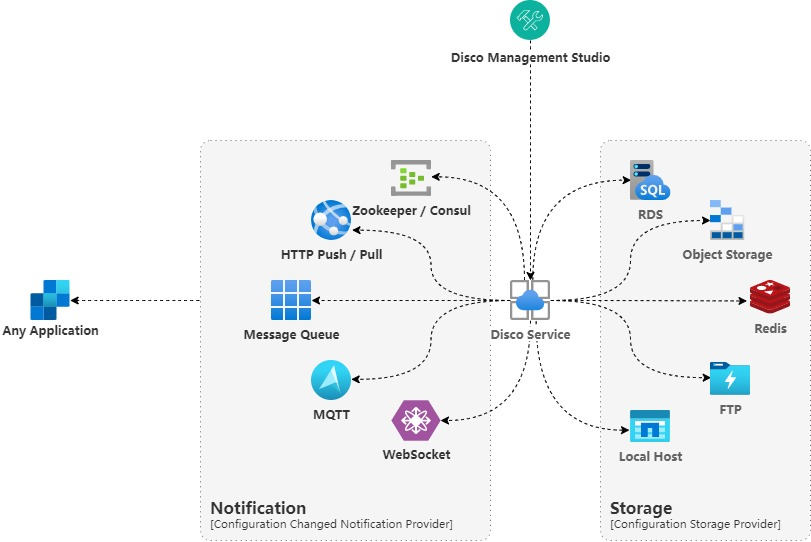

# Disco

> *什么是 **“Disco”**？“Disco”是基于 .NET 平台开发的分布式配置管理服务。“Disco”是开源的、免费的。*
>
> *What is **"Disco"**? "Disco" is a distributed configuration management service based on the .NET platform development."Disco" is open source and free.*

![Disco][icon]

----

## 介绍 Introduction

- **摘要 Summary**
  - **开发环境 Development Environment**

    |开发环境 Development Environment|
    |---------|
    |**Microsoft Windows 11** *22H2 内部版本 22621.1413*|
    |**Microsoft [Visual Studio 2022][vs]** v17.5+|
    |**[Microsoft .NET][dotnet]** 7|
    |**[Microsoft VSCode][vscode]**|
    |**[Node](https://nodejs.org/en)** 18 LTS|
    |**PowerShell**|
    |**Git for Windows**|

  - **部署环境 Deployment Environment**
    - ~~稍候补充~~

## 文档 Documentation

- **目录 Table Of Content**

----

我们选择了更为流行、宽松的 [MIT 许可证](LICENSE.md)。

We chose a more popular and loose [THE MIT LICENSE](LICENSE.md).

[icon]: ./assets/Icons/Disco-64.png
[vs]: https://docs.microsoft.com/en-us/visualstudio/releases/2022/release-notes-v17.5#17.5.2
[dotnet]: https://dotnet.microsoft.com/zh-cn/download
[vscode]: https://code.visualstudio.com/